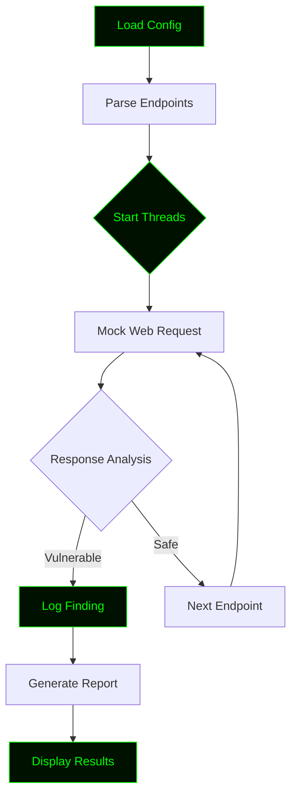

# Web-Strom

<!-- ═══════════════════════════════════════════════════════════════════════ -->
<!--                        WEB-STROM - README.md                            -->
<!--                  Professional Hacker-Style Documentation                -->
<!-- ═══════════════════════════════════════════════════════════════════════ -->

<div align="center">

<!-- Animated Header Banner -->


<!-- Typing Animation -->


<br>

<!-- Status Badges -->
<p>


</p>

<p>


</p>

<br>

<!-- Matrix Rain GIF -->


</div>

---

<div align="center">

```ascii
██╗    ██╗███████╗██████╗       ███████╗████████╗██████╗  ██████╗ ███╗   ███╗
██║    ██║██╔════╝██╔══██╗      ██╔════╝╚══██╔══╝██╔══██╗██╔═══██╗████╗ ████║
██║ █╗ ██║█████╗  ██████╔╝█████╗███████╗   ██║   ██████╔╝██║   ██║██╔████╔██║
██║███╗██║██╔══╝  ██╔══██╗╚════╝╚════██║   ██║   ██╔══██╗██║   ██║██║╚██╔╝██║
╚███╔███╔╝███████╗██████╔╝      ███████║   ██║   ██║  ██║╚██████╔╝██║ ╚═╝ ██║
 ╚══╝╚══╝ ╚══════╝╚═════╝       ╚══════╝   ╚═╝   ╚═╝  ╚═╝ ╚═════╝ ╚═╝     ╚═╝

                    [ Scan | Detect | Secure ]
```

</div>

---

## ⚠️ Legal Disclaimer

<div align="center">

```
┌──────────────────────────────────────────────────────────────────────┐
│                                                                      │
│   WEB-STROM is a SIMULATION tool built for EDUCATIONAL purposes.     │
│                                                                      │
│   ▸ It does NOT attack, exploit, or target any real system.          │
│   ▸ It does NOT send malicious requests to any live service.         │
│   ▸ Unauthorized use of web scanning techniques is ILLEGAL.          │
│   ▸ The author is NOT responsible for any misuse.                    │
│                                                                      │
│   Use responsibly. Hack ethically. Learn endlessly.                  │
│                                                                      │
└──────────────────────────────────────────────────────────────────────┘
```

</div>

---

## 🎯 Overview

> **WEB-STROM** is a Python-based **web application security simulation framework** that demonstrates how vulnerability scanning, endpoint discovery, and threat detection work — all in a **safe, controlled, mock environment**.

Built for security researchers, students, and ethical hackers who want to **learn by doing** without crossing legal lines.

---

## ✨ Core Features

<div align="center">

| | Feature | Description |
|:---:|:---|:---|
| 🔍 | **Endpoint Discovery** | Finds hidden routes and endpoints |
| 🛡️ | **Vulnerability Scanner** | Simulates XSS, SQLi, LFI checks |
| ⚡ | **Multi-Threaded Engine** | Parallel scanning for speed |
| 📊 | **Live Progress Bar** | Real-time terminal feedback |
| 📝 | **JSON Reports** | Structured, machine-readable output |
| 🎨 | **Hacker Terminal UI** | Green-on-black aesthetic |
| 🧪 | **Lab Mode** | Test your own local web apps safely |
| 🔧 | **Custom Payloads** | Bring your own wordlists |

</div>

---

## 🚀 Installation

<div align="center">

</div>

### ⚡ One-Line Install

```bash
git clone https://github.com/anonmoty/Web-Strom.git && cd Web-Strom && pip install -r requirements.txt && python webstrom.py --help
```

### 🐧 Linux / 🍎 macOS

```bash
# Step 1 — Clone the repo
git clone https://github.com/anonmoty/Web-Strom.git

# Step 2 — Enter the directory
cd Web-Strom

# Step 3 — Install dependencies
pip install -r requirements.txt

# Step 4 — Make it executable
chmod +x DDOS.py

# Step 5 — Start scanning
python DDOS.py
```

### 🪟 Windows (PowerShell)

```powershell
git clone https://github.com/anonmoty/Web-Strom.git
cd Web-Strom
pip install -r requirements.txt
python webstrom.py --help
```

### 🐳 Docker

```bash
docker run -it --rm ghcr.io/anonmoty/web-strom:latest --help
```

---

## 🎯 Usage

```bash
# Basic scan
python webstrom.py --target mock --wordlist endpoints.txt

# Multi-threaded scan
python webstrom.py --target mock --threads 20 --wordlist endpoints.txt

# Save report
python webstrom.py --target mock --output reports/scan.json

# Full power mode
python webstrom.py --target mock --threads 50 --wordlist endpoints.txt \
                   --output reports/scan.json --verbose

# Lab mode (test your own app)
python webstrom.py --target http://localhost:8080 --lab-mode
```

### CLI Flags

| Flag | Description |
|:---|:---|
| `--target` | Target mock or URL |
| `--wordlist` | Path to endpoint wordlist |
| `--threads` | Number of threads (default: 10) |
| `--output` | Report output path |
| `--verbose` | Enable verbose logging |
| `--lab-mode` | Test your own local app |
| `--help` | Show help menu |

---

## 🧠 How It Works



1. **Load** — Reads endpoints and config
2. **Dispatch** — Sends requests to mock web app
3. **Analyze** — Checks status codes, headers, and body
4. **Log** — Saves findings to JSON report
5. **Report** — Displays a clean, structured summary

---

## 📁 Project Structure

```
Web-Strom/
├── webstrom.py               # Main entry point
├── core/
│   ├── __init__.py
│   ├── scanner.py            # Scanning engine
│   ├── analyzer.py           # Response analysis
│   └── reporter.py           # Report generator
├── payloads/
│   ├── endpoints.txt         # Endpoint wordlist
│   └── payloads.txt          # Attack payloads
├── reports/                  # Generated reports
├── tests/                    # Unit tests
├── requirements.txt
├── LICENSE
└── README.md
```

---

## 📸 Demo

<div align="center">

```
┌─────────────────────────────────────────────────────────────┐
│            _______  ______     _______ _________ _______  _______  _______ 
|\     /|(  ____ \(  ___ \   (  ____ \\__   __/(  ____ )(  ___  )(       )
| )   ( || (    \/| (   ) )  | (    \/   ) (   | (    )|| (   ) || () () |
| | _ | || (__    | (__/ /   | (_____    | |   | (____)|| |   | || || || |
| |( )| ||  __)   |  __ (    (_____  )   | |   |     __)| |   | || |(_)| |
| || || || (      | (  \ \         ) |   | |   | (\ (   | |   | || |   | |
| () () || (____/\| )___) )  /\____) |   | |   | ) \ \__| (___) || )   ( |
(_______)(_______/|/ \___/   \_______)   )_(   |/   \__/(_______)|/     \|
                                                                          
└─────────────────────────────────────────────────────────────┘

[✓] Dependencies loaded
[✓] Endpoints: 1,247
[✓] Threads: 20
[→] Scanning...

[████████████████████████░░░░░░] 80% | 997/1247
[!] VULNERABLE: /admin
[!] VULNERABLE: /debug
[✓] Scan complete in 4.32s
[✓] Report: reports/scan_2024.json

        Happy Hunting! 🎯
```

</div>

---

## 🛠️ Requirements

```txt
requests>=2.28.0
colorama>=0.4.6
tqdm>=4.65.0
rich>=13.0.0
```

Install:

```bash
pip install -r requirements.txt
```

---

## 🎨 Hacker Terminal Theme

WEB-STROM uses a **green-on-black** theme by default:

```python
THEME = {
    "primary":   "\033[92m",   # Bright Green
    "secondary": "\033[32m",   # Dark Green
    "error":     "\033[91m",   # Red
    "warning":   "\033[93m",   # Yellow
    "info":      "\033[96m",   # Cyan
    "reset":     "\033[0m",    # Reset
}
```

---

## 🗺️ Roadmap

- [x] Multi-threaded scanning engine
- [x] JSON report generation
- [x] Hacker terminal UI
- [ ] XSS detection module
- [ ] SQLi detection module
- [ ] LFI/RFI detection module
- [ ] Web dashboard
- [ ] Docker image
- [ ] pip package

---

## 🤝 Contributing

Contributions are welcome. Please follow these steps:

1. Fork the repository
2. Create your branch (`git checkout -b feature/amazing-feature`)
3. Commit your changes (`git commit -m 'Add amazing feature'`)
4. Push to the branch (`git push origin feature/amazing-feature`)
5. Open a Pull Request

---

## 📜 License

Distributed under the **MIT License**. See [`LICENSE`](LICENSE) for more information.

---

## 🙏 Credits

- **Author:** [@anonmoty](https://github.com/anonmoty)
- **Inspired by:** The open-source security community
- **Built with:** Python, caffeine, and curiosity ☕

---

<div align="center">


<br><br>

### ⭐ If this project helped you, drop a star!


</div>
